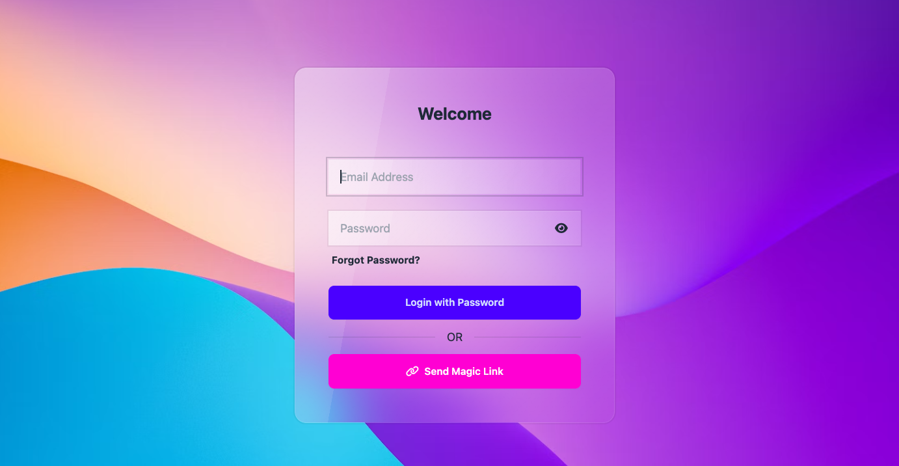

# FastAPI HTMX Login

An authentication demo for login patterns with FastAPI backend and HTMX frontend integration.
This project demonstrates password-based login, magic link authentication, and password reset.



## ✨ Features

| Feature | Description | Security |
|---------|-------------|----------|
| **🔐 Password Login** | Traditional email/password authentication | Secure JWT tokens |
| **✨ Magic Link Login** | Passwordless authentication via email links | 5-minute token expiration |
| **🔄 Password Reset** | Secure password reset flow | Anti-enumeration protection |
| **🚀 HTMX Integration** | Seamless partial page updates | No JavaScript frameworks needed |
| **🍪 Session Management** | HTTP-only cookies for security | Automatic token refresh |
| **📧 Email Templates** | Professional MJML email templates | Responsive design |


## Roadmap

- [ ] welcome screen style + logout button
- [ ] reset password form
- [ ] other login auth methods


## 🚀 Quick Start

### Prerequisites
- Python 3.11+
- Node.js (for email template building ;)

### Installation

1. **Clone the repository:**
   ```bash
   git clone https://github.com/rebeling/fastapi-htmx-login.git
   cd fastapi-htmx-login
   ```

2. **Using Make**
- `make start` — Start the application.
- `make dev` — Sync dev dependencies via uv.
- `make install` — Install locked deps with uv.
- `make lint` / `make fix` — Lint and auto-fix with Ruff.
- `make emails-install` — Install Node deps for MJML templates.
- `make emails` — Build MJML templates to HTML.
- `make emails-min` — Build minified HTML emails.
- `make emails-rebuild` — Clean and rebuild emails.
- `uv run pytest` — Run tests (add `--cov=app` for coverage).
- `make hooks-install` — Install a pre-commit hook that runs Ruff and pytest.
- `make hooks-remove` — Remove the pre-commit hook.

## 🎯 How to Use

### Demo Credentials
- **Email**: `test@example.com`
- **Password**: `password123`

### Authentication Methods

#### 🔐 Password Login
1. Navigate to the home page
2. Enter the demo email and password
3. Click "Login with Password"
4. You'll be redirected to the welcome page

#### ✨ Magic Link Login
1. Navigate to the home page
2. Enter the demo email address
3. Click "Send Magic Link"
4. **Check your terminal/console** - the magic link will be displayed
5. Copy and visit the magic link in your browser
6. You'll be automatically logged in

#### 🔄 Password Reset
1. Click "Forgot Password?" on the login page
2. Click "Send reset link"
3. **Check your terminal/console** - the reset link will be displayed
4. Copy and visit the reset link in your browser

### 📧 Email Development
For local email testing, install and run mailcatcher:
```bash
gem install mailcatcher
mailcatcher
```
Then visit `http://localhost:1080` to see sent emails.

## 🛠️ Technology Stack

| Component | Technology | Purpose |
|-----------|------------|---------|
| **Backend** | [FastAPI](https://fastapi.tiangolo.com/) | High-performance web framework |
| **Frontend** | [HTMX](https://htmx.org/) | Dynamic interactions without JS frameworks |
| **Templates** | [Jinja2](https://jinja.palletsprojects.com/) | Server-side HTML rendering |
| **Authentication** | [Python-jose](https://python-jose.readthedocs.io/) | JWT token handling |
| **Email Templates** | [MJML](https://mjml.io/) | Responsive email design |
| **Styling** | [DaisyUI](https://daisyui.com/) + [Tailwind CSS](https://tailwindcss.com/) | Modern UI components |
| **Server** | [Uvicorn](https://www.uvicorn.org/) | ASGI application server |
